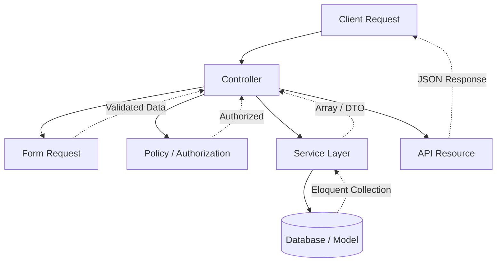

# 📘 PUSIM Magang Enterprise v2.0 - Engineering Handbook & Standards

**Version:** 1.0  
**Effective Date:** 04 August 2026  
**Status:** OFFICIAL STANDARD  

---

## 📑 Table of Contents
1. [Project Philosophy](#1-project-philosophy)
2. [Project Architecture](#2-project-architecture)
3. [Controller Rules](#3-controller-rules)
4. [Form Request Rules](#4-form-request-rules)
5. [Service Layer Rules](#5-service-layer-rules)
6. [Policy Rules](#6-policy-rules)
7. [API Resource Rules](#7-api-resource-rules)
8. [Database Rules](#8-database-rules)
9. [Error Handling](#9-error-handling)
10. [Logging](#10-logging)
11. [PHP Standards](#11-php-standards)
12. [Naming Conventions](#12-naming-conventions)
13. [Code Review Checklist](#13-code-review-checklist)
14. [Git Workflow](#14-git-workflow)
15. [Module Development Workflow](#15-module-development-workflow)
16. [Technical Debt Policy](#16-technical-debt-policy)
17. [Definition of Done](#17-definition-of-done)
18. [Quality Gates](#18-quality-gates)
19. [Engineering Principles](#19-engineering-principles)
20. [Final Declaration](#20-final-declaration)

---

## 1. PROJECT PHILOSOPHY
**Enterprise First, Maintainability First, Readability First.** 
We are building software meant to last 5+ years. 
- **Backward Compatibility:** Never break existing API endpoints unless absolutely required and versioned.
- **Convention over Configuration:** Rely on standard Laravel structures instead of inventing custom wheels.
- **SOLID Principles:** Single Responsibility, Open/Closed, Liskov Substitution, Interface Segregation, Dependency Inversion.
- **DRY (Don't Repeat Yourself):** Abstract duplicate logic into Traits, Base Classes, or Services.
- **KISS (Keep It Simple, Stupid):** Avoid premature optimization or overly complex abstractions.
- **YAGNI (You Aren't Gonna Need It):** Build what is required *now*, not what *might* be required later.

---

## 2. PROJECT ARCHITECTURE
The backend strictly adheres to a layered Service-Oriented structure.

### Layer Responsibilities
- **Controller:** Translates HTTP requests to business calls.
- **Form Request:** Validates input payload and handles initial structural validation.
- **Policy:** Enforces authorization (IDOR protection, Role checks).
- **Service:** The brain. Holds business rules, calculations, and DB transactions.
- **Model:** Interacts with the database, defines relationships and hidden fields.
- **API Resource:** Shapes the final JSON payload.

---

## 3. CONTROLLER RULES
**Rule:** Controllers are HTTP adapters ONLY.

**Controllers May ONLY:**
- Receive the Request.
- Call Authorization (`$this->authorize()`).
- Invoke a Service layer method.
- Return an API Resource or JSON Response.

**Controllers MUST NOT:**
- Contain business logic.
- Contain validation rules (`$request->validate()`).
- Contain Database Queries (`User::where(...)`).
- Contain logging or notification dispatching.
- Contain calculations, file storage operations, or complex `if/else` conditionals.

---

## 4. FORM REQUEST RULES
**Rule:** Validation belongs exclusively in Form Requests.
- **NEVER** use `$request->validate()` inside a Controller.
- Validation must be reusable across endpoints (e.g., `StoreTaskRequest`, `UpdateTaskRequest`).
- Centralize authorization logic within the Form Request `authorize()` method only if it is specific to the payload format. Otherwise, return `true` and defer to Policies.

---

## 5. SERVICE LAYER RULES
**Rule:** Services contain the business rules.
- Services manage Create, Update, Delete, Assign, Approve, Reject, Synchronize, and Event Triggers.
- Services **MUST NOT** generate HTTP responses, return `JsonResponse`, or know anything about the `Illuminate\Http\Request` object.
- Services accept scalar arrays, strings, ints, Models, or DTOs.

---

## 6. POLICY RULES
**Rule:** Authorization must be centralized in Policies.
- **NEVER** check roles manually inside Controllers (e.g., `if ($user->role === 'admin')`).
- Always use `Policies` (for Model-bound authorization) or `Gates` (for global actions).
- Keep the IDOR logic explicitly documented in the Policy.

---

## 7. API RESOURCE RULES
**Rule:** Every API response must use `JsonResource` or `ResourceCollection`.
- Never manually build JSON arrays inside Controllers (`return response()->json(['data' => $task])`).
- API Resources ensure consistent formatting (Date strings, casting, removing hidden attributes).

---

## 8. DATABASE RULES
- **Transactions:** Always use `DB::transaction()` whenever multiple entities (tables) are modified simultaneously.
- **N+1 Problem:** Always use Eager Loading (`with()`).
- **Loops:** NEVER execute queries (`->save()`, `->update()`, `->find()`) inside a loop. Use bulk inserts or queue workers.
- **Indexes:** Use Foreign Keys and Indexes for frequently searched columns.

---

## 9. ERROR HANDLING
- **Business Errors:** Throw `App\Exceptions\BusinessException`. The global handler will catch it and return an HTTP 400/422.
- **Unexpected Errors:** Let them bubble up to Laravel's Exception Handler.
- **Security:** NEVER expose stack traces or raw SQL syntax in production environments.

---

## 10. LOGGING
- **Information:** Standard user lifecycle (e.g., "User registered", "Task created").
- **Warning:** Suspicious activities (e.g., "Failed login limit reached").
- **Error:** Catchable exceptions that degrade UX.
- **Critical:** Database failures, third-party API downtime.
- Never duplicate logging logic; let the Service Layer handle it.

---

## 11. PHP STANDARDS
**MANDATORY RULES:**
- Every PHP file MUST start with `declare(strict_types=1);`
- Every method MUST have explicit return types.
- Favor Constructor Property Promotion (PHP 8).
- Use Dependency Injection via constructors.
- Write PHPDoc blocks for public Service and Controller methods.
- Avoid static methods unless strictly acting as utility pure functions.
- Prefer `final class` unless inheritance is intentionally required.

---

## 12. NAMING CONVENTIONS
- **Controllers:** PascalCase, Plural or Concept noun + Controller (e.g., `TaskController`).
- **Services:** PascalCase, Concept + Service (e.g., `TaskService`).
- **Policies:** PascalCase, Model + Policy (e.g., `TaskPolicy`).
- **Requests:** Action + Model + Request (e.g., `StoreTaskRequest`).
- **Resources:** Model + Resource (e.g., `TaskResource`).
- **DTO:** Concept + DTO (e.g., `TaskPayloadDTO`).
- **Traits:** Concept + Trait (e.g., `ApiResponseTrait`).

---

## 13. CODE REVIEW CHECKLIST
Every Pull Request must be verified against:
- [ ] Controller is Thin (No Business Logic).
- [ ] Validation is inside Form Request.
- [ ] Authorization uses Policy.
- [ ] Complex Logic resides in Service.
- [ ] Controller returns an API Resource.
- [ ] Multi-table writes are wrapped in DB Transactions.
- [ ] Exceptions use `BusinessException`.
- [ ] Return Types and Strict Types (`declare(strict_types=1)`) are applied.
- [ ] No duplicated/dead code.
- [ ] No magic strings/numbers.

---

## 14. GIT WORKFLOW
1. **Feature Branch:** `feature/task-module`, `fix/login-error`
2. **Pull Request (PR)**
3. **Architecture Review:** Check against standards.
4. **QA / Testing**
5. **Merge to Main**
6. **Release**

---

## 15. MODULE DEVELOPMENT WORKFLOW
For every new module or refactoring effort:
**Architecture Review ➔ Implementation ➔ Self Review ➔ Architecture Gate Review ➔ Manual Review ➔ Merge.**

---

## 16. TECHNICAL DEBT POLICY
- **Acceptable Debt:** Lack of full unit test coverage during MVP phase, using arrays instead of strict DTOs temporarily.
- **Unacceptable Debt:** Logic in controllers, N+1 queries, unhandled exceptions, raw SQL queries.
- **When to Refactor:** Whenever touching an old file to add a new feature (Boy Scout Rule).
- **When NOT to Refactor:** If the refactor breaks backward compatibility without a migration plan.

---

## 17. DEFINITION OF DONE
A module is considered complete ONLY if:
1. Controllers are thin.
2. Validation uses Form Requests.
3. Business logic is isolated in Services.
4. Authorization leverages Policies.
5. API Responses leverage Resources.
6. DB Transactions are implemented for multi-writes.
7. Exceptions are standardized.
8. Architecture Gate Review passes.

---

## 18. QUALITY GATES
Every sprint MUST pass:
- **Build Success** (Composer & NPM).
- **Linting** (PHP_CodeSniffer / ESLint).
- **Type Safety** (PHPStan / TypeScript Compiler).
- **Architecture Review** (Peer review).
- **Manual Smoke Test.**

---

## 19. ENGINEERING PRINCIPLES

1. **SRP-1: Thin Controllers**
   - *Description:* Controllers only route traffic.
   - *Reason:* Easier to test APIs.
2. **VAL-1: Centralized Validation**
   - *Description:* Use Form Requests.
   - *Reason:* Reusable rules, uncluttered controllers.
3. **SVC-1: Service Isolation**
   - *Description:* Services don't know HTTP exists.
   - *Reason:* Services can be called via CLI, Jobs, or HTTP identically.
4. **SEC-1: Centralized Auth**
   - *Description:* IDOR checks go in Policies.
   - *Reason:* Security is never forgotten if the gate is central.
5. **DB-1: Transaction Wrapping**
   - *Description:* Wrap multi-table inserts in DB::transaction.
   - *Reason:* Prevents orphaned rows upon unexpected errors.
6. **ERR-1: Meaningful Exceptions**
   - *Description:* Throw `BusinessException` for logical stops.
   - *Reason:* Auto-renders to JSON, prevents silent failures.
7. **RES-1: API Resources**
   - *Description:* Output is formatted via `JsonResource`.
   - *Reason:* Protects hidden fields, formats dates globally.
8. **PHP-1: Strict Types**
   - *Description:* `declare(strict_types=1);` on line 2.
   - *Reason:* Prevents implicit type juggling bugs.
9. **PHP-2: Explicit Returns**
   - *Description:* Every method must define a return type.
   - *Reason:* Self-documenting code.
10. **PERF-1: Eager Loading**
    - *Description:* `Model::with('relation')->get()`.
    - *Reason:* Destroys N+1 bottlenecks.

---

## 20. FINAL DECLARATION
This document serves as the absolute, official engineering standard for **PUSIM Magang Enterprise v2.0**.
All future backend development, refactoring, and AI-assisted coding sprints **MUST** comply with this handbook. Deviations are only permitted upon explicit approval by the Architecture Review Board.
